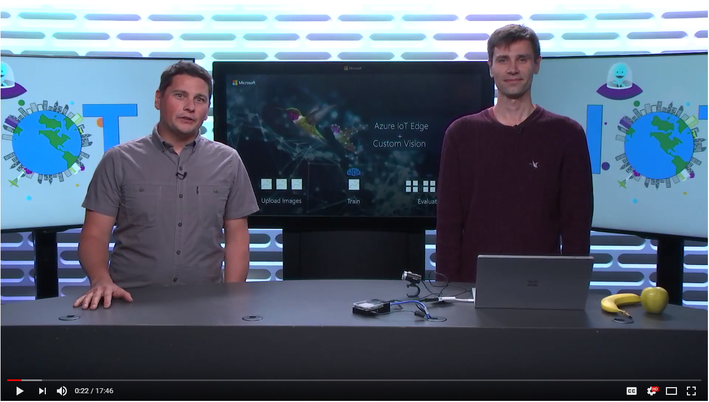
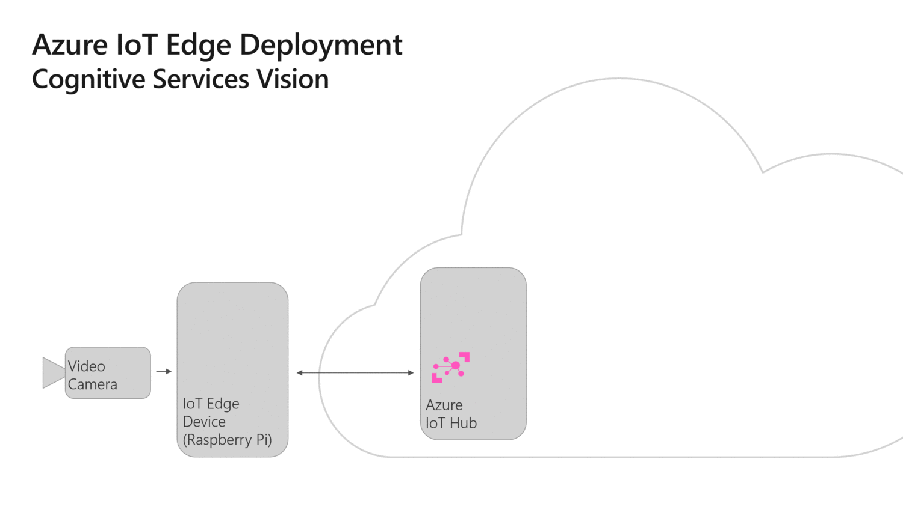
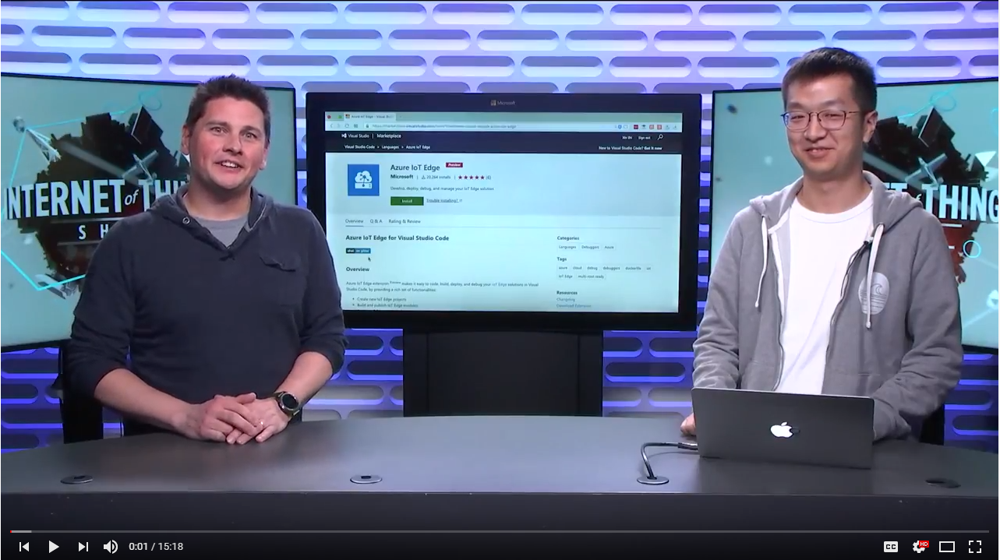
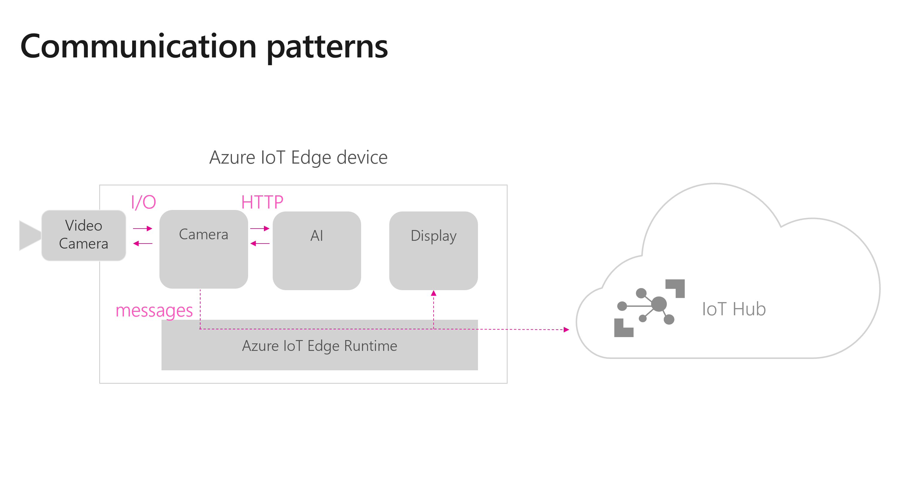

# Custom Vision + Azure IoT Edge on a Raspberry Pi 3

This is a sample showing how to deploy a Custom Vision model to a Raspberry Pi 3 device running Azure IoT Edge. Custom Vision is an image classifier that is trained in the cloud with your own images. IoT Edge gives you the possibility to run this model next to your cameras, where the video data is being generated. You can thus add umeaning to your video streams to detect road traffic conditions, estimate wait lines, find parking spots, etc. while keeping your video footage private, lowering your bandwith costs and even running offline.

This sample can also be deployed on an x64 machine (aka your PC). It has been ported to the newer IoT Edge GA bits.

Check out [this video](https://www.youtube.com/watch?v=_K5fqGLO8us) to see this demo in action and understand how it was built:

## Prerequisites

### Hardware
You can run this solution on either of the following hardware:

- **Raspberry Pi 3**: Set up Azure IoT Edge on a Raspberry Pi 3 ([instructions to set up the hardware - use raspbian 9 (stretch) or above)](https://blog.jongallant.com/2017/11/raspberrypi-setup/) + [instructions to install Azure IoT Edge](https://docs.microsoft.com/en-us/azure/iot-edge/how-to-install-iot-edge-linux-arm)) with a [SenseHat](https://www.raspberrypi.org/products/sense-hat/) and use the arm32v7 tags.

- **Simulated Azure IoT Edge device** (such as a PC): Set up Azure IoT Edge ([instructions on Windows](https://docs.microsoft.com/en-us/azure/iot-edge/how-to-install-iot-edge-windows-with-linux), [instructions on Linux](https://docs.microsoft.com/en-us/azure/iot-edge/how-to-install-iot-edge-linux)) and use the amd64 tags. A test x64 deployment manifest is already available. To use it, rename the `deployment.template.test-amd64` to `deployment.template.json`, then build the IoT Edge solution from this manifest and deploy it to an x64 device.
 
### Services
Check out the animation below to see how a IoT Edge deployment works. You can also get more details through [this tutorial](https://docs.microsoft.com/en-us/azure/iot-edge/module-deployment-monitoring) to see how a IoT Edge deployment works. You must have the following services set up to use this sample:
- **Azure IoT Hub**: This is your Cloud gateway which is needed to manage your IoT Edge devices. All deployments to Edge devices are made through an IoT Hub. You can use the free sku for this sample.
- **Azure Container Registry**: This is where you host your containers (e.g. IoT Edge modules). Deployment manifests refer to this container registry for the IoT Edge devices to download their images.You can use the free sku for this sample.

### Tooling
You need the following dev tools to do IoT Edge development in general, to make this sample run and edit it:
- **Visual Studio Code**: IoT Edge development environment. [Download it from here](https://code.visualstudio.com/).
- **Visual Studio Code: Azure IoT Edge Extension**: An extension that connects to your IoT Hub and lets you manage your IoT Devices and IoT Edge Devices right from VS Code. A must-have for IoT Edge development. [Download it from here](https://marketplace.visualstudio.com/items?itemName=vsciot-vscode.azure-iot-edge). Once installed, connect it to your IoT Hub.

To learn more about this development environment, check out [this tutorial](https://docs.microsoft.com/en-us/azure/iot-edge/how-to-deploy-modules-vscode) and [this video](https://www.youtube.com/watch?v=C5eTQ1cwlLk&t=1s&index=35&list=PLlrxD0HtieHh5_pOv-6xsMxS3URD6XD52):

## Description of the solution
### Modules
This solution is made of 3 modules:

- **Camera capture** - this module captures the video stream from a USB camera, sends the frames for analysis to the custom vision module and shares the output of this analysis to the edgeHub. This module is written in python and uses [OpenCV](https://opencv.org/) to read the video feed.
- **Custom vision** - it is a web service over HTTP running locally that takes in images and classifies them based on a custom model built via the [Custom Vision website](https://azure.microsoft.com/en-us/services/cognitive-services/custom-vision-service/). This module has been exported from the Custom Vision website and slightly modified to run on a ARM architecture. You can modify it by updating the model.pb and label.txt files to update the model.
- **SenseHat display** - this module gets messages from the edgeHub and blinks the raspberry Pi's senseHat according to the tags specified in the inputs messages. This module is written in python and requires a [SenseHat](https://www.raspberrypi.org/products/sense-hat/) to work. The amd64 template does not include this module since it is a raspberry pi only device.

### Commnucation between modules
This is how the above three modules communicate between themselves and with the cloud:

## Get started
### On a Raspberry Pi 3
1. Clone this sample
2. Update the `.env` file with the values for your container registry and make sure that your docker engine has access to it
3. Build the entire solution by right-clicking on the `deployment.template.json` file and select `Build IoT Edge Solution` (this can take a while...especially to build open-cv, numpy and pillow...)
4. Deploy the solution to your device by right-clicking on the `config/deployment.json` file, select `Create Deployment for IoT Edge device` and choose your targeted device
5. Monitor the messages being sent to the Cloud by right-clicking on yoru device from the VS Code IoT Edge extenstion and select `Start Monitoring D2C Message` 

### On an x64 PC
1. Clone this sample
1. Update the `.env` file with the values for your container registry and make sure that your docker engine has access to it
2. Rename the `deployment.template.json` file into `deployment.template.RPI.json`
3. Rename the `deployment.template.test-amd64.json` file into `deployment.template.json`
4. Build the entire solution by right-clicking on the `deployment.template.json` file and select `Build IoT Edge Solution` (this can take a while...especially to build numpy and pillow...)
5. Deploy the solution to your device by right-clicking on the `config/deployment.json` file, select `Create Deployment for IoT Edge device` and choose your targeted device
6. Monitor the messages being sent to the Cloud by right-clicking on yoru device from the VS Code IoT Edge extenstion and select `Start Monitoring D2C Message` 

## Going further
### Update the AI model
Download your own custom vision model from the custom vision service. You just need to replace the `ImageClassifierService/app/model.pb` and `ImageClassifierService/app/labels.txt` provided by the export feature of Custom Vision. 
### Update the configuration of the camera capture module
Explore the various configuration options of the camera module availabel [here](https://github.com/Azure-Samples/Custom-vision-service-iot-edge-raspberry-pi/tree/master/modules/CameraCapture), to score your ai model against a camera feed vs a video clip, to resize your images, to see logs, etc.